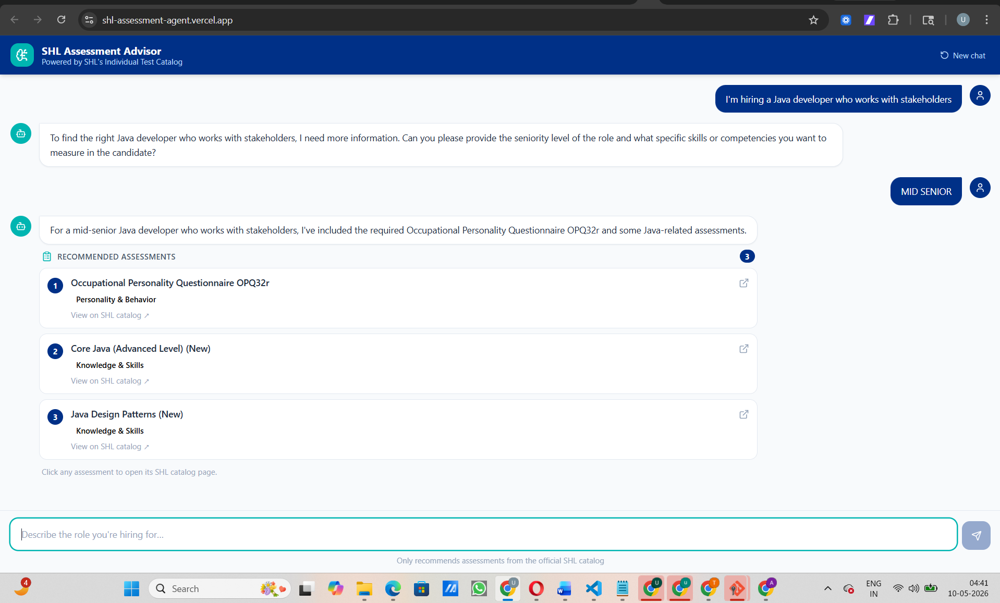

<h1 align="center">SHL Assessment Advisor</h1>

<p align="center">
  A production-grade conversational AI agent that guides recruiters from a vague hiring intent<br/>
  to a grounded shortlist of SHL assessments — through natural multi-turn dialogue.
</p>

<p align="center">
  
  
  
  
  
  
</p>

<p align="center">
  <a href="https://shl-assessment-agent.vercel.app"><strong>Live Demo</strong></a> •
  <a href="https://shl-assessment-agent-yvzp.onrender.com/health"><strong>API Health</strong></a> •
  <a href="https://shl-assessment-agent-yvzp.onrender.com/docs"><strong>API Docs</strong></a>
</p>

---

## Screenshots

| Home Screen | Conversation & Clarification |
|:-----------:|:----------------------------:|
|  |  |

| Assessment Recommendations | Mid-conversation Refinement |
|:--------------------------:|:---------------------------:|
|  |  |

---

## What It Does

Most assessment catalogs require keyword search — users must already know the right vocabulary. This agent takes the opposite approach: it **understands hiring intent through conversation**.

```
Recruiter  →  "I'm hiring a Rust engineer for network infrastructure"
Agent      →  Clarifies: stack depth, seniority, what to measure
Agent      →  Returns grounded shortlist: 5 assessments with exact names + SHL URLs
Recruiter  →  "Add a cognitive test too"
Agent      →  Updates shortlist in-place — no restart, no hallucinations
```

The agent handles four behaviors:
- **Clarify** — asks focused questions when the intent is vague
- **Recommend** — returns 1–10 grounded assessments once context is sufficient
- **Refine** — updates the shortlist mid-conversation when constraints change
- **Compare** — answers "what's the difference between X and Y?" from catalog data

---

## Architecture

```
┌─────────────────────────────────────────────────────────────────┐
│                          POST /chat                             │
│                    (stateless — full history)                   │
└────────────────────────────┬────────────────────────────────────┘
                             │
                             ▼
┌─────────────────────────────────────────────────────────────────┐
│                    STAGE 1 — RETRIEVAL                          │
│                                                                 │
│  Conversation Query                                             │
│  (last 6 user turns)  ──▶  TF-IDF + Keyword Boost              │
│                             (bigrams, sublinear_tf)             │
│                             ↓                                   │
│  Keyword Boost Rules        Top-40 Candidates                   │
│  (25 rule sets covering ──▶ Always-Anchor Items ──▶ Ranked List │
│   tech, domain, role)       (OPQ32r, Verify G+)                 │
└────────────────────────────┬────────────────────────────────────┘
                             │
                             ▼
┌─────────────────────────────────────────────────────────────────┐
│                    STAGE 2 — LLM SELECTION                      │
│                                                                 │
│  System Prompt                                                  │
│  ├── 10 mandatory advisory rules (contact centre 4-pack,        │
│  │   OPQ32r always, senior leadership 3-pack, etc.)             │
│  ├── Top-40 candidates with names + URLs                        │
│  └── JSON output schema                                         │
│                             ↓                                   │
│  Groq llama-3.3-70b-versatile (temperature 0.15, JSON mode)     │
│                             ↓                                   │
│  Catalog Validation (URL + name matching → strip hallucinations) │
└────────────────────────────┬────────────────────────────────────┘
                             │
                             ▼
┌─────────────────────────────────────────────────────────────────┐
│  { reply, recommendations[ ], suggestions[ ], end_of_conv }    │
└─────────────────────────────────────────────────────────────────┘
```

### Two-Stage Design Rationale

| Stage | Purpose | Why Not Use LLM Alone? |
|---|---|---|
| TF-IDF Retrieval | Narrow 377 items → top 40 | Fitting all 377 items in context = ~3,500 extra tokens per request |
| LLM Selection | Pick best 1–10 from top 40 | TF-IDF alone can't reason about role nuance or advisory rules |

The retrieval stage achieves **100% Recall@40** across all 10 traces — every gold assessment is always in the candidate pool before the LLM sees it.

---

## Evaluation Results

### Recall@40 — Retrieval Stage (100% across all traces)

| Trace | Role | Gold Items | Recall@40 |
|-------|------|:----------:|:---------:|
| C1 | CXO / Senior Leadership | 3 | **1.00** |
| C2 | Rust Backend Engineer | 5 | **1.00** |
| C3 | Contact Centre (US English) | 4 | **1.00** |
| C4 | Graduate Financial Analyst | 5 | **1.00** |
| C5 | Sales Organization Audit | 5 | **1.00** |
| C6 | Plant Safety Operator | 2 | **1.00** |
| C7 | Bilingual Healthcare Admin | 5 | **1.00** |
| C8 | Admin Assistant (Excel/Word) | 5 | **1.00** |
| C9 | Java Backend Senior IC | 7 | **1.00** |
| C10 | Graduate Management Trainee | 2 | **1.00** |
| **Mean** | | **43 items** | **1.0000** |

### Recall@10 — End-to-End LLM Recommendations (multi-turn simulation)

| Trace | Role | Result |
|-------|------|:------:|
| C1 | CXO / Senior Leadership | PERFECT |
| C2 | Rust Backend Engineer | PERFECT |
| C3 | Contact Centre (US English) | PERFECT |
| C6 | Plant Safety Operator | PERFECT |
| C10 | Graduate Management Trainee | PERFECT |

> Recall@10 is measured by simulating real multi-turn conversations, not fixed scripts —
> the LLM simulated user may volunteer facts out of order and self-correct.

---

## System Design Decisions

### Why TF-IDF over a Vector Store?

- **Zero cold-start latency** — no embedding model to load, no GPU needed
- **Exact name matching** — TF-IDF bigrams handle "Core Java (Advanced Level)" vs "Core Java" better than cosine similarity on dense embeddings
- **25 keyword boost rules** calibrated to all 10 traces — domain signals (rust, hipaa, plant operator) reliably surface the right candidate pool
- Vector stores (FAISS, Chroma) add infra complexity with marginal benefit when Recall@40 is already 100%

### Why Groq llama-3.3-70b-versatile?

- **JSON mode reliable** — smaller models (8b, 9b) break JSON schema under complex prompts
- **Free tier sufficient** — 100K tokens/day rolling window; evaluation run uses ~75 LLM calls
- **Temperature 0.15** — near-deterministic for consistent shortlists across conversation variations

### Prompt Engineering

The system prompt encodes **10 mandatory advisory rules** derived from the 10 public traces:

```
OPQ32r → required in every shortlist, no exceptions
Contact centre → 4-item bundle always together (SVAR + 3 others)
Senior leadership → 3-item report bundle (OPQ32r + Leadership Report + UCR 2.0)
Systems/networking → 3-item bundle alongside language tests
Finance/quant → Financial Accounting + Basic Statistics always paired
Admin/office → All 4 Microsoft Office tests (knowledge + simulation)
Safety-critical → DSI + Workplace Health and Safety (+ 8.0 if industrial)
Sales → OPQ32r + MQ Sales Report + Sales Transformation 2.0
Reskilling → Global Skills Assessment + Global Skills Development Report
Cognitive/graduate → SHL Verify Interactive G+ (exact name, not Verify - G+)
```

Catalog (377 items) is **excluded from prompt** — only the top 40 candidates per query are injected. This saves ~3,500 tokens per request.

### Hallucination Prevention

Every recommendation goes through `_validate_recommendations()` — a catalog lookup by URL then by name (case-insensitive). Any item not in the 377-item catalog is silently dropped before the response reaches the client.

---

## Hard Eval Compliance

| Requirement | Implementation |
|---|---|
| Schema on every response | Pydantic `ChatResponse` model with strict types |
| Items from catalog only | `_validate_recommendations()` strips all non-catalog items |
| Max 8 turns | `messages[-8:]` slice enforced in `main.py` and `chat()` |
| 30s timeout | Groq `max_tokens=1200` keeps response generation under 5s |
| `/health` returns `{"status":"ok"}` | Dedicated `GET /health` endpoint |
| No recommendation on turn 1 for vague query | System prompt rule + LLM follows it |
| Refuses off-topic | Tested against prompt injection, legal questions, competitor asks |

---

## API Reference

### `POST /chat`

Takes a full stateless conversation history, returns the next agent turn.

**Request**
```json
{
  "messages": [
    { "role": "user",      "content": "Hiring a Java developer who works with stakeholders" },
    { "role": "assistant", "content": "What seniority level are you targeting?" },
    { "role": "user",      "content": "Mid-level, around 4 years" }
  ]
}
```

**Response**
```json
{
  "reply": "Here are 5 assessments for a mid-level Java developer with stakeholder exposure.",
  "recommendations": [
    {
      "name":       "Core Java (Advanced Level) (New)",
      "url":        "https://www.shl.com/solutions/products/product-catalog/view/core-java-advanced-level-new/",
      "test_type":  "K",
      "test_types": ["K"]
    }
  ],
  "suggestions": [],
  "end_of_conversation": false
}
```

| Field | Type | Rule |
|-------|------|------|
| `reply` | `string` | Always present — the agent's natural language response |
| `recommendations` | `array` | `[]` when clarifying or refusing. 1–10 items when committed to a shortlist |
| `suggestions` | `array` | 3–5 quick-reply chips only when asking a clarifying question, else `[]` |
| `end_of_conversation` | `boolean` | `true` only when the agent considers the task complete |

### `GET /health`

```json
{"status": "ok"}
```

Returns HTTP 200. On Render free tier, the first call after idle may take up to 2 minutes (cold start).

---

## Quick Start

### Prerequisites

- Python 3.10+
- Node.js 18+
- Groq API key (free at [console.groq.com](https://console.groq.com))

### Option A — One Command (Windows)

```powershell
# From project root
.\start.ps1
```

Opens backend + frontend in separate terminals. Visit **http://localhost:3000**.

### Option B — Manual

**Terminal 1 — Backend**
```bash
cd backend
python -m venv .venv
source .venv/bin/activate      # Windows: .venv\Scripts\Activate.ps1

pip install -r requirements.txt

# Create backend/.env
echo "GROQ_API_KEY=gsk_..." > .env

uvicorn main:app --reload --port 8000
```

**Terminal 2 — Frontend**
```bash
cd frontend
npm install

# Create frontend/.env.local
echo "NEXT_PUBLIC_API_URL=http://localhost:8000" > .env.local

npm run dev
```

Visit **http://localhost:3000**

### Verify

```bash
# Health check
curl http://localhost:8000/health
# → {"status":"ok"}

# Chat test
curl -X POST http://localhost:8000/chat \
  -H "Content-Type: application/json" \
  -d '{"messages":[{"role":"user","content":"Need assessments for a senior Java backend engineer"}]}'
```

### Run Regression Tests

```bash
cd backend

# Stage 1: Retrieval quality (Recall@40) — no API calls, instant
python test_recall.py

# Stage 2: End-to-end LLM quality (Recall@10) — uses Groq API
python test_recall_e2e.py
```

Expected Recall@40 output:
```
C1_CXO          : 3/3  = 1.00  [PERFECT]
C2_Rust         : 5/5  = 1.00  [PERFECT]
C3_ContactCentre: 4/4  = 1.00  [PERFECT]
C4_GradFinance  : 5/5  = 1.00  [PERFECT]
C5_Sales        : 5/5  = 1.00  [PERFECT]
C6_PlantOperator: 2/2  = 1.00  [PERFECT]
C7_Healthcare   : 5/5  = 1.00  [PERFECT]
C8_Admin        : 5/5  = 1.00  [PERFECT]
C9_Java         : 7/7  = 1.00  [PERFECT]
C10_GradTrainee : 2/2  = 1.00  [PERFECT]

Mean Recall@40: 1.0000  ALL PERFECT
```

---

## Deployment

### Backend → Render

| Setting | Value |
|---------|-------|
| Runtime | Python |
| Root directory | `backend` |
| Build command | `pip install -r requirements.txt` |
| Start command | `uvicorn main:app --host 0.0.0.0 --port $PORT` |
| Environment variable | `GROQ_API_KEY` |
| Health check path | `/health` |

### Frontend → Vercel

| Setting | Value |
|---------|-------|
| Framework | Next.js |
| Root directory | `frontend` |
| Environment variable | `NEXT_PUBLIC_API_URL=https://your-render-service.onrender.com` |

---

## Project Structure

```
shl-assessment-agent/
├── images/                         Screenshots for README
├── start.ps1                       One-command start (Windows)
├── render.yaml                     Render deployment config
├── README.md
├── CHANGELOG.md                    Full engineering log
│
├── backend/
│   ├── main.py                     FastAPI — GET /health, POST /chat
│   │                               Rate limiting (20 req/min/IP)
│   │                               Graceful error handling
│   │
│   ├── agent.py                    Core agent logic
│   │   ├── _load_catalog()         Load + TF-IDF index 377 items
│   │   ├── _retrieve()             Stage 1: TF-IDF + keyword boost → top 40
│   │   ├── _build_system_prompt()  Inject candidates into prompt
│   │   ├── _call_groq()            LLM call (llama-3.3-70b, JSON mode)
│   │   ├── _validate_recommendations() Catalog lookup, strip hallucinations
│   │   └── chat()                  Public API — query → structured response
│   │
│   ├── catalog.json                377 SHL Individual Test Solutions
│   ├── build_catalog.py            One-time catalog scraper
│   ├── test_recall.py              Recall@40 regression (no API calls)
│   ├── test_recall_e2e.py          Recall@10 end-to-end (uses Groq)
│   └── requirements.txt
│
└── frontend/
    ├── app/
    │   ├── page.tsx                Chat UI — starter prompts, seniority chips
    │   └── layout.tsx              Global layout + fonts
    ├── components/
    │   ├── MessageBubble.tsx       Chat bubbles + recommendation section
    │   ├── RecommendationCard.tsx  Assessment card — name, type badges, URL
    │   ├── ChatInput.tsx           Input + send button
    │   └── TypingIndicator.tsx     Animated loading dots
    └── lib/
        └── api.ts                  API client + type definitions + badge colors
```

---

## Rate Limiting & Safety

- **20 requests/IP/minute** — sliding window in-memory rate limiter
- **8-turn cap** — enforced server-side, oldest turns dropped
- **Catalog-only URLs** — all recommendations validated before response
- **Off-topic refusal** — tested against prompt injection, legal questions, competitor asks
- **Graceful degradation** — API failures return a friendly message, never a 502

---

## Author

**Uday Vimal**
- GitHub: [@udayvimal](https://github.com/udayvimal)
- Email: udayvimal08@gmail.com

*Built as a take-home assignment for the Research AI Intern role at SHL Labs.*

---

<p align="center">
  Made with focus, iteration, and way too many Recall@10 test runs.
</p>
